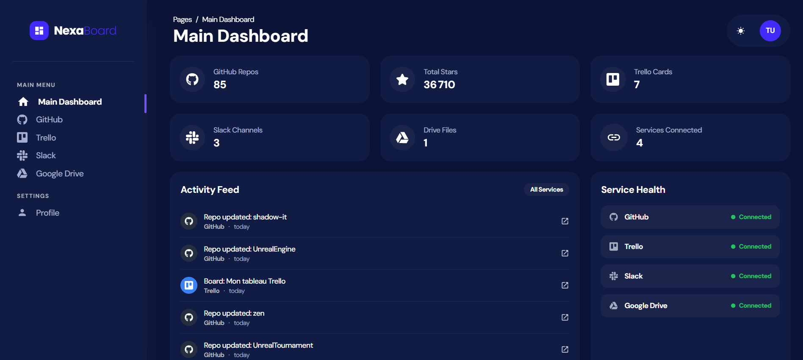
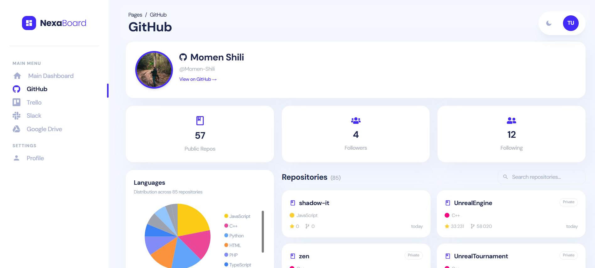
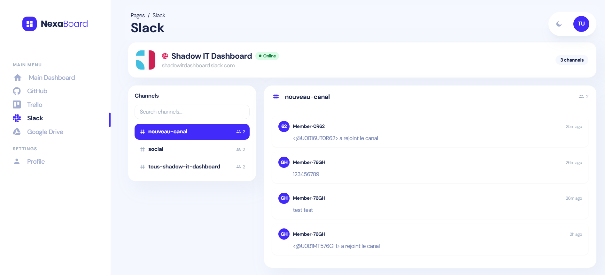
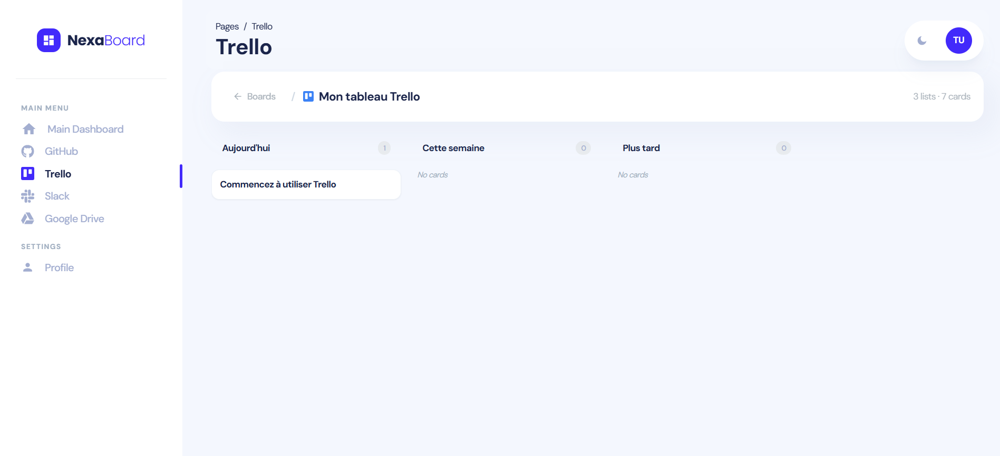
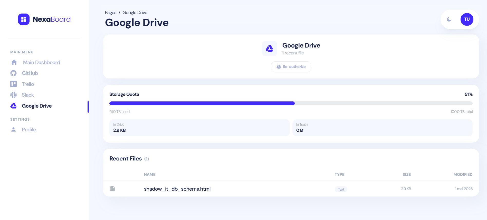
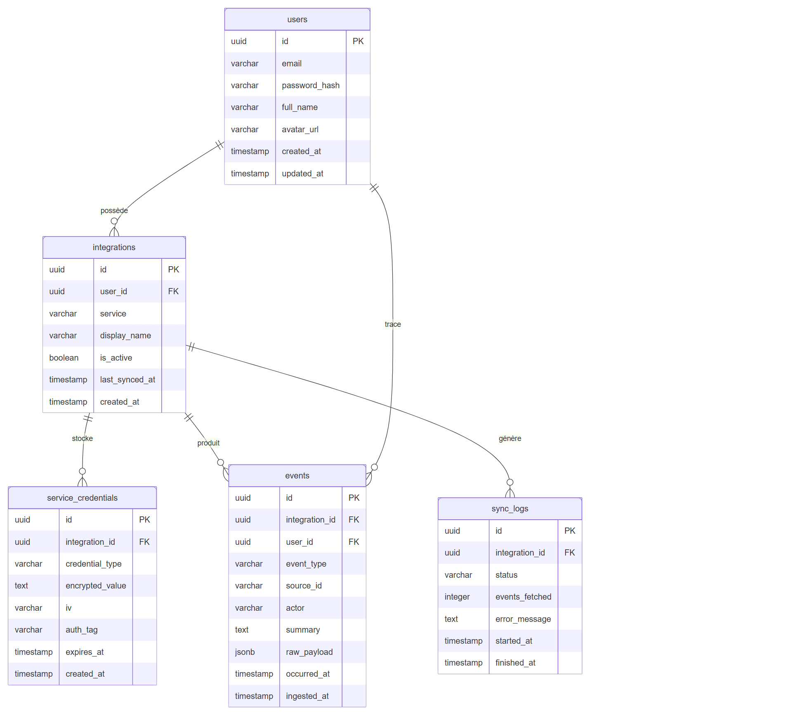

# Shadow IT

A comprehensive platform for discovering and managing shadow IT resources across your organization with OAuth integrations and enterprise tool connectivity.

## Overview

Shadow IT is a full-stack web application designed to help organizations identify, track, and manage unauthorized software and tools being used within their infrastructure. It provides seamless integrations with popular platforms like GitHub, Google, Slack, and Trello while maintaining a secure, user-friendly dashboard.

## Features

- **OAuth Authentication**: Secure login 
- **GitHub Integration**: Connect and manage GitHub repositories and accounts
- **Google Integration**: Authenticate and access Google Drive
- **Slack Integration**: Connect Slack workspaces for communication insights
- **Trello Integration**: Track Trello boards and card activities
- **Admin Dashboard**: Comprehensive analytics and management interface
- **Real-time Data Sync**: Keep your shadow IT inventory up-to-date
- **User Management**: Upcoming

## Screenshots

### Login Page


### Main Dashboard


### Dark Theme


### GitHub Integration


### Slack Integration


### Trello Integration


### Google Drive Integration


### User Profile


## Tech Stack

### Backend
- **Node.js** with Express.js
- **SQLite/Database** (configured via migration system)
- **REST API** architecture

### Frontend
- **React.js** (ES6+)
- **Tailwind CSS** for styling
- **PostCSS** for CSS processing
- **Chart.js** for data visualization
- **React Router** for navigation

## Project Structure

```
shadow-it/
├── backend/                    # Express.js server
│   ├── src/
│   │   ├── config/            # Database and configuration
│   │   ├── controllers/       # Request handlers for each service
│   │   ├── middleware/        # Auth, validation, error handling
│   │   └── routes/            # API route definitions
│   ├── server.js              # Entry point
│   └── package.json
│
├── frontend/                   # React application
│   ├── public/                # Static files
│   ├── src/
│   │   ├── components/        # Reusable UI components
│   │   ├── views/             # Page components
│   │   ├── layouts/           # Layout wrappers
│   │   ├── services/          # API service calls
│   │   ├── context/           # React context (Auth, etc.)
│   │   ├── assets/            # Images, styles
│   │   ├── App.jsx            # Root component
│   │   └── routes.js          # Route configuration
│   ├── package.json
│   └── tailwind.config.js     # Tailwind configuration
│
└── README.md                   # This file
```
### DB Schema



## Installation

### Prerequisites
- Node.js (v14 or higher)
- npm or yarn package manager
- Git

### Backend Setup

1. Navigate to the backend directory:
   ```bash
   cd backend
   ```

2. Install dependencies:
   ```bash
   npm install
   ```

3. Configure environment variables (create `.env` file):
   ```
   PORT=5000
   NODE_ENV=development
   DATABASE_URL=sqlite:///shadow-it.db
   GITHUB_CLIENT_ID=your_github_client_id
   GITHUB_CLIENT_SECRET=your_github_client_secret
   GOOGLE_CLIENT_ID=your_google_client_id
   GOOGLE_CLIENT_SECRET=your_google_client_secret
   SLACK_TOKEN=your_slack_token
   TRELLO_KEY=your_trello_key
   TRELLO_TOKEN=your_trello_token
   ```

4. Run database migrations:
   ```bash
   npm run db:migrate
   ```

### Frontend Setup

1. Navigate to the frontend directory:
   ```bash
   cd frontend
   ```

2. Install dependencies:
   ```bash
   npm install
   ```

3. Configure environment variables (create `.env` file):
   ```
   REACT_APP_API_URL=http://localhost:5000
   REACT_APP_GITHUB_CLIENT_ID=your_github_client_id
   REACT_APP_GOOGLE_CLIENT_ID=your_google_client_id
   ```

## Running the Application

### Development Mode

**Backend:**
```bash
cd backend
npm start
```
The server will run on `http://localhost:5000`

**Frontend:**
```bash
cd frontend
npm start
```
The application will open on `http://localhost:3000`


## API Endpoints

### Authentication
- `POST /api/auth/login` - User login
- `POST /api/auth/logout` - User logout
- `GET /api/auth/profile` - Get current user profile
- `GET /api/auth/github` - GitHub OAuth callback
- `GET /api/auth/google` - Google OAuth callback

### Integrations
- `GET /api/integrations` - List all integrations
- `POST /api/integrations/github` - Connect GitHub account
- `POST /api/integrations/google` - Connect Google account
- `POST /api/integrations/slack` - Connect Slack workspace
- `POST /api/integrations/trello` - Connect Trello account

### GitHub
- `GET /api/github/repos` - List repositories
- `GET /api/github/user` - Get user info

### Google
- `GET /api/google/profile` - Get Google profile

### Slack
- `GET /api/slack/workspaces` - List workspaces
- `GET /api/slack/channels` - List channels

### Trello
- `GET /api/trello/boards` - List boards
- `GET /api/trello/cards` - List cards

## Environment Variables

The application requires the following environment variables to function properly. Set them in `.env` files in both backend and frontend directories.

### Backend (.env)
```
PORT=5000
NODE_ENV=development
DATABASE_URL=sqlite:///shadow-it.db
GITHUB_CLIENT_ID=
GITHUB_CLIENT_SECRET=
GOOGLE_CLIENT_ID=
GOOGLE_CLIENT_SECRET=
SLACK_TOKEN=
TRELLO_KEY=
TRELLO_TOKEN=
JWT_SECRET=your_jwt_secret_key
```

### Frontend (.env)
```
REACT_APP_API_URL=http://localhost:5000
REACT_APP_GITHUB_CLIENT_ID=
REACT_APP_GOOGLE_CLIENT_ID=
```

## Security Considerations

- All API endpoints require authentication via JWT tokens
- OAuth credentials are securely stored and never exposed to the frontend
- Environment variables containing secrets should never be committed to version control
- Use HTTPS in production environments
- Implement rate limiting for API endpoints
- Validate and sanitize all user inputs

