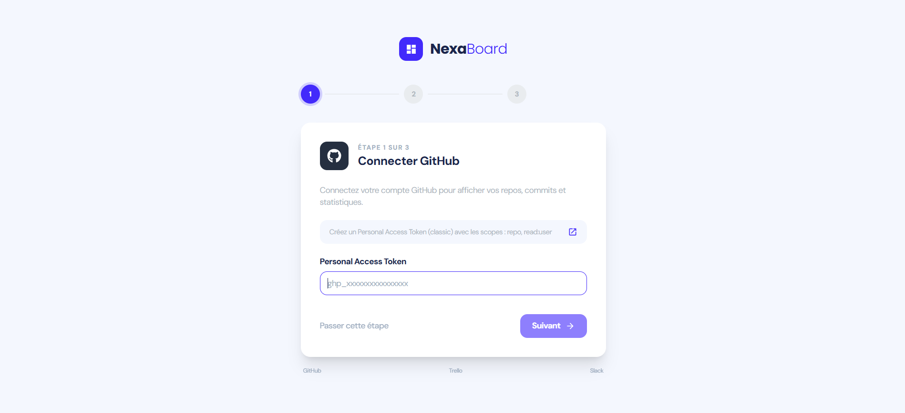
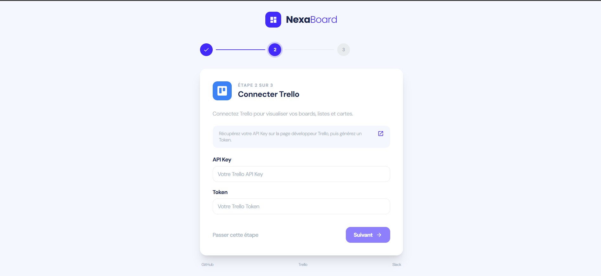
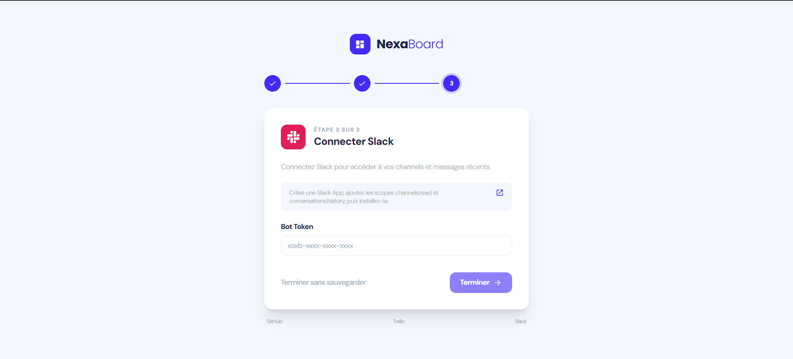
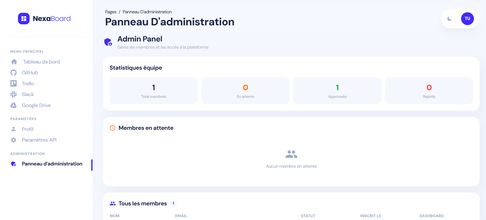

# NexaBoard — Shadow IT Dashboard

Une plateforme full-stack de centralisation opérationnelle qui agrège les données de GitHub, Trello, Slack et Google Drive dans un tableau de bord unifié. Développée dans le cadre d'un Projet de Fin d'Année (PFA) — 3ème année Génie Informatique.

**Auteurs :** Momen Shili & Manef Dakhlaoui

---

## Aperçu

NexaBoard résout un problème concret dans les équipes de développement modernes : la fragmentation de l'information entre plusieurs outils SaaS. Au lieu de naviguer entre GitHub, Trello, Slack et Google Drive, chaque membre de l'équipe dispose d'un tableau de bord unifié affichant toutes ses données en un seul endroit.

Les administrateurs (chefs d'équipe) peuvent superviser tous les membres, approuver ou rejeter les nouveaux comptes, et inspecter le tableau de bord de n'importe quel membre.

---

## Fonctionnalités

- **Authentification JWT** — Système à double token (accès 15min + rafraîchissement 7 jours) avec renouvellement silencieux automatique
- **Gestion des rôles** — `team_member` (par défaut) et `admin` (chef d'équipe)
- **Flux d'approbation des comptes** — Les nouveaux comptes nécessitent l'approbation de l'admin avant de pouvoir se connecter
- **Clés API par utilisateur** — Chaque membre connecte ses propres comptes GitHub, Trello et Slack
- **Onboarding guidé** — Configuration étape par étape après approbation du compte
- **Intégration GitHub** — Profil, dépôts, étoiles, forks, graphique des langages, historique des commits
- **Intégration Trello** — Tableaux, listes, vue Kanban avec labels et dates d'échéance
- **Intégration Slack** — Informations sur l'espace de travail, liste des canaux, historique des messages
- **Intégration Google Drive** — Flux OAuth2, liste des fichiers, quota de stockage
- **Fil d'Activité Unifié** — Événements mélangés de tous les services triés par date
- **Statut des Services** — Indicateur temps réel connecté/déconnecté par service
- **Panneau Admin** — Gestion des membres, approbation/rejet, statistiques équipe, journaux d'activité

---

## Captures d'écran

### Page de Connexion


### Tableau de Bord Principal


### Thème Sombre


### Intégration GitHub


### Intégration Slack


### Intégration Trello


### Intégration Google Drive


### Profil Utilisateur


### Onboarding — Étape 1 (GitHub)


### Onboarding — Étape 2 (Trello)


### Onboarding — Étape 3 (Slack)


### Panneau Administrateur


### Schéma de Base de Données


---

## Stack Technique

### Backend
- **Node.js 20.x** avec **Express.js 4.x**
- **PostgreSQL 16** via `pg` (node-postgres)
- **JWT** (jsonwebtoken) — authentification à double token
- **bcryptjs** — hachage des mots de passe (12 tours de sel)
- **AES-256-GCM** — chiffrement des clés API et tokens OAuth stockés en base
- **googleapis** — client OAuth2 pour Google Drive
- **axios** — appels HTTP serveur vers les APIs externes
- **helmet** — en-têtes de sécurité HTTP
- **express-rate-limit** — limitation de débit (100 req/15min global, 10 req/15min auth)

### Frontend
- **React 18.x** avec **React Router 6.x**
- **Tailwind CSS 3.x** — styling utilitaire
- **Horizon UI** (template gratuit) — entièrement rebrandé NexaBoard
- **Axios** — client HTTP avec intercepteurs JWT
- **ApexCharts** — graphiques en barres et en secteurs dynamiques
- **React Context** — état d'authentification global

### Schéma de Base de Données
| Table | Rôle |
|---|---|
| `users` | Comptes avec rôle, statut (pending/approved/rejected) |
| `refresh_tokens` | Hachages des tokens de rafraîchissement JWT |
| `user_api_keys` | Clés GitHub/Trello/Slack chiffrées par utilisateur |
| `service_credentials` | Tokens OAuth2 Google Drive (AES-256-GCM) |
| `integrations` | Enregistrements d'intégrations à des fins d'audit |
| `activity_logs` | Journal des actions admin (approuvé/rejeté/consulté) |

---

## Structure du Projet

```
shadow-it/
├── backend/                        # API REST Express.js (port 5000)
│   ├── server.js                   # Point d'entrée — configuration middleware
│   ├── .env                        # Variables d'environnement (ne jamais committer)
│   ├── .env.example                # Template des variables d'environnement
│   └── src/
│       ├── config/
│       │   ├── db.js               # Pool PostgreSQL (max 20 connexions)
│       │   └── migrate.js          # Création du schéma — exécuter une fois
│       ├── middleware/
│       │   ├── auth.js             # verifyToken + requireRole()
│       │   ├── errorHandler.js     # Gestionnaire d'erreurs global
│       │   └── validate.js         # Middleware express-validator
│       ├── controllers/
│       │   ├── authController.js   # register, login, refresh, logout, me
│       │   ├── adminController.js  # members, approve, reject, stats, logs
│       │   ├── apiKeysController.js # save/get/delete clés API par utilisateur
│       │   ├── githubController.js # profile, repos, commits
│       │   ├── trelloController.js # boards, lists, cards
│       │   ├── slackController.js  # workspace, channels, messages
│       │   └── googleController.js # OAuth2, files, quota
│       └── routes/
│           ├── index.js            # Agrège toutes les routes sous /api
│           ├── auth.js             # /api/auth/*
│           ├── admin.js            # /api/admin/* (rôle admin uniquement)
│           ├── apiKeys.js          # /api/keys/*
│           ├── github.js           # /api/github/*
│           ├── trello.js           # /api/trello/*
│           ├── slack.js            # /api/slack/*
│           └── google.js           # /api/google/*
│
└── frontend/                       # SPA React (port 3000)
    ├── public/
    ├── images/                     # Captures d'écran du projet
    └── src/
        ├── views/
        │   ├── auth/
        │   │   ├── SignIn.jsx       # Page de connexion
        │   │   └── SignUp.jsx       # Page d'inscription
        │   └── admin/
        │       ├── default/        # Tableau de bord principal
        │       ├── github/         # Page GitHub
        │       ├── trello/         # Page Trello Kanban
        │       ├── slack/          # Page messages Slack
        │       ├── google/         # Page Google Drive
        │       ├── profile/        # Profil utilisateur
        │       ├── settings/       # Gestion des clés API
        │       ├── onboarding/     # Configuration guidée après approbation
        │       ├── admin-panel/    # Gestion des membres (admin)
        │       └── 404/            # Page introuvable
        ├── services/
        │   ├── api.js              # Client Axios avec intercepteurs JWT
        │   └── authService.js      # Fonctions login, logout, register
        ├── context/
        │   └── AuthContext.js      # État auth global (user, login, logout)
        ├── components/             # Composants UI partagés (sidebar, navbar...)
        ├── routes.js               # Config des routes avec labels de section
        ├── App.jsx                 # PrivateRoute + définitions des routes
        └── index.js                # Point d'entrée avec AuthProvider
```

---

## Installation

### Prérequis

- Node.js v20.x ou supérieur
- PostgreSQL 16.x
- Git
- Un compte GitHub (pour le Personal Access Token)
- Un compte Trello (pour la clé API + Token)
- Un espace de travail Slack (pour le Bot Token)
- Un projet Google Cloud (pour OAuth2 Drive)

---

### Configuration du Backend

**1. Naviguer vers le dossier backend :**
```bash
cd backend
```

**2. Installer les dépendances :**
```bash
npm install
```

**3. Créer le fichier d'environnement :**
```bash
copy .env.example .env      # Windows
cp .env.example .env        # Mac/Linux
```

**4. Remplir le `.env` :**
```env
# Serveur
PORT=5000
NODE_ENV=development

# PostgreSQL
DB_HOST=localhost
DB_PORT=5432
DB_NAME=shadow_it_db
DB_USER=postgres
DB_PASSWORD=votre_mot_de_passe

# JWT
JWT_SECRET=votre_clé_secrète_jwt_min_32_chars
JWT_EXPIRES_IN=15m
JWT_REFRESH_SECRET=votre_clé_refresh_secrète_min_32_chars
JWT_REFRESH_EXPIRES_IN=7d

# Chiffrement (pour les clés API stockées en DB)
ENCRYPTION_KEY=votre_clé_hex_64_caractères

# CORS
CLIENT_URL=http://localhost:3000

# Google OAuth2 (Drive)
GOOGLE_CLIENT_ID=votre_client_id.apps.googleusercontent.com
GOOGLE_CLIENT_SECRET=votre_client_secret
GOOGLE_REDIRECT_URI=http://localhost:5000/api/google/callback
```

> **Note :** Les tokens GitHub, Trello et Slack sont maintenant stockés par utilisateur en base de données. Inutile de les mettre dans le `.env`.

**5. Créer la base de données :**
```bash
psql -U postgres -c "CREATE DATABASE shadow_it_db;"
```

**6. Lancer les migrations :**
```bash
npm run db:migrate
```

**7. Créer le premier administrateur manuellement :**
```sql
-- D'abord s'inscrire via l'API, puis promouvoir en admin :
UPDATE users SET role = 'admin', status = 'approved' WHERE email = 'votre@email.com';
```

**8. Démarrer le backend :**
```bash
npm run dev
```
Serveur disponible sur `http://localhost:5000`

---

### Configuration du Frontend

**1. Naviguer vers le dossier frontend :**
```bash
cd frontend
```

**2. Installer les dépendances :**
```bash
npm install
```

**3. Démarrer le frontend :**
```bash
npm start
```
Application disponible sur `http://localhost:3000`

---

## Flux Utilisateur

### Nouveau Membre
1. Aller sur `/auth/sign-up` → créer un compte
2. Voir le message : *"Votre compte est en attente d'approbation par un administrateur"*
3. L'admin approuve le compte
4. Connexion → redirigé vers l'**Onboarding** → ajouter les clés GitHub/Trello/Slack
5. Accès au tableau de bord complet avec ses propres données

### Administrateur (Chef d'Équipe)
1. Se connecter avec le compte admin
2. Accéder au **Panneau Admin** → voir les membres en attente
3. Approuver ou rejeter les membres
4. Consulter le tableau de bord de n'importe quel membre
5. Voir les statistiques équipe et les journaux d'activité

---

## Endpoints API

### Authentification (`/api/auth`)
| Méthode | Endpoint | Auth | Description |
|---|---|---|---|
| POST | `/api/auth/register` | Aucune | Créer un compte (statut : pending) |
| POST | `/api/auth/login` | Aucune | Connexion (bloquée si pending/rejected) |
| POST | `/api/auth/refresh` | Aucune | Rafraîchir le token d'accès |
| POST | `/api/auth/logout` | Aucune | Invalider le token de rafraîchissement |
| GET | `/api/auth/me` | JWT | Profil de l'utilisateur connecté |

### Admin (`/api/admin`) — Rôle admin uniquement
| Méthode | Endpoint | Description |
|---|---|---|
| GET | `/api/admin/members` | Liste tous les membres avec leur statut |
| PATCH | `/api/admin/members/:id/approve` | Approuver un membre en attente |
| PATCH | `/api/admin/members/:id/reject` | Rejeter un membre (définitif) |
| GET | `/api/admin/members/:id/dashboard` | Voir le tableau de bord d'un membre |
| GET | `/api/admin/stats` | Statistiques de l'équipe |
| GET | `/api/admin/logs` | Journaux d'activité (50 dernières actions) |

### Clés API (`/api/keys`) — JWT requis
| Méthode | Endpoint | Description |
|---|---|---|
| GET | `/api/keys` | Vérifier quelles clés sont configurées (booléens) |
| POST | `/api/keys` | Sauvegarder/mettre à jour les clés GitHub/Trello/Slack |
| DELETE | `/api/keys/:service` | Supprimer la clé d'un service spécifique |

### GitHub (`/api/github`) — JWT + clé configurée
| Méthode | Endpoint | Description |
|---|---|---|
| GET | `/api/github/profile` | Profil GitHub de l'utilisateur |
| GET | `/api/github/repos` | Dépôts avec étoiles, forks, langage |
| GET | `/api/github/commits` | Commits récents |

### Trello (`/api/trello`) — JWT + clé configurée
| Méthode | Endpoint | Description |
|---|---|---|
| GET | `/api/trello/boards` | Tous les tableaux |
| GET | `/api/trello/boards/:id/lists` | Listes d'un tableau |
| GET | `/api/trello/boards/:id/cards` | Cartes d'un tableau |

### Slack (`/api/slack`) — JWT + clé configurée
| Méthode | Endpoint | Description |
|---|---|---|
| GET | `/api/slack/workspace` | Informations sur l'espace de travail |
| GET | `/api/slack/channels` | Canaux publics |
| GET | `/api/slack/channels/:id/messages` | 20 derniers messages |

### Google Drive (`/api/google`) — OAuth2
| Méthode | Endpoint | Description |
|---|---|---|
| GET | `/api/google/auth` | Générer l'URL de consentement OAuth2 |
| GET | `/api/google/callback` | Gérer le callback OAuth2 |
| GET | `/api/google/files` | Fichiers récents |
| GET | `/api/google/quota` | Quota de stockage |

---

## Sécurité

- **Mots de passe** — bcryptjs avec 12 tours de sel, jamais stockés en clair
- **JWT** — HS256, token d'accès 15min, token de rafraîchissement 7 jours
- **Clés API** — Chiffrées AES-256-GCM en base, jamais retournées en clair au frontend
- **Tokens Google** — Chiffrés AES-256-GCM par utilisateur dans `service_credentials`
- **Rate Limiting** — 100 req/15min global, 10 req/15min sur les routes auth
- **CORS** — Seul `http://localhost:3000` autorisé
- **Helmet** — CSP, HSTS, X-Frame-Options, protection XSS
- **Validation** — express-validator sur toutes les routes POST/PATCH
- **Guards de rôle** — Les routes admin exigent `role = 'admin'` côté serveur
- **Guards de statut** — Connexion bloquée côté serveur pour les comptes `pending` et `rejected`

---

## Variables d'Environnement

### Backend `.env`

| Variable | Requis | Description |
|---|---|---|
| `PORT` | Oui | Port du serveur (défaut : 5000) |
| `DB_HOST` | Oui | Hôte PostgreSQL |
| `DB_NAME` | Oui | Nom de la base de données |
| `DB_USER` | Oui | Utilisateur de la base de données |
| `DB_PASSWORD` | Oui | Mot de passe de la base de données |
| `JWT_SECRET` | Oui | Clé secrète du token d'accès (32+ chars) |
| `JWT_REFRESH_SECRET` | Oui | Clé secrète du token de rafraîchissement (32+ chars) |
| `ENCRYPTION_KEY` | Oui | Clé AES-256 pour chiffrer les clés API (64 chars hex) |
| `CLIENT_URL` | Oui | URL du frontend pour CORS |
| `GOOGLE_CLIENT_ID` | Oui | Client ID OAuth2 Google |
| `GOOGLE_CLIENT_SECRET` | Oui | Secret client OAuth2 Google |
| `GOOGLE_REDIRECT_URI` | Oui | URL de callback OAuth2 Google |

> Les identifiants GitHub, Trello et Slack sont stockés par utilisateur en base de données — pas dans le `.env`.

---

## Licence

Ce projet a été développé dans le cadre d'un PFA académique.
**Auteurs :** Momen Shili & Manef Dakhlaoui — 2025/2026
